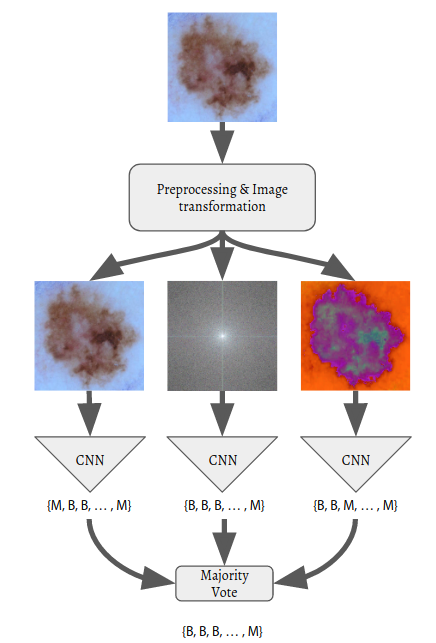

# Skin Lesion Classification
# Transformation-based approach to CNNs

<p align="center">

</p>

## Installing / Getting started
A minimal setup you need to get running.

### Requirements
- NVIDIA GPU 
- cuda 
- cudnn
- python 3
- pip

### Setting up

#### Sonnet and TensorFlow
Compile and Install [Sonnet](https://github.com/deepmind/sonnet/#installation-instructions) and [TensorFlow](https://www.tensorflow.org/install/) using their guides for use with at least 1 GPU.

#### Virtual Environment (Recommended)
The following commands are assuming several locations which may be different for your system.
[virtualenvwrapper](http://virtualenvwrapper.readthedocs.io/en/latest/index.html)

```shell
sudo -H pip install virtualenvwrapper
mkvirtualenv --python=/usr/bin/python3 isic_cnn
git clone https://github.gatech.edu/clehman31/isic_cnn.git
cd isic_cnn
workon isic_cnn
pip install [where ever you stored your TensorFlow and Sonnet .whl files]
pip install -R requirements.txt
``` 

## Resources

### Dataset
We modified the [ISIC-archive](https://isic-archive.com/) by creating square crops registered on the legion in the images in order to remove large colored stickers and normalize the scale. Any images where the legion was smaller than 100px X 100px were not used. This resulted in ~6000 images.

### Paper

[Skin Lesion Classification: Transformation-based approach to CNNs](http://ghassanalregib.com/)

## Experiment 

### Preparing input
First, download the data and generate the TFRecords using isic_input.py.  This will build random 80/20 split for training/testing images, it does not care about distribution of labels. Be sure to indicate the where the images are located and what you want the TFRecords to be named.

#### isic_input.py

```python3
IMAGE_SHAPE = [220, 220, 3]
NUM_EXAMPLES_PER_EPOCH_FOR_TRAIN = 4540
NUM_EXAMPLES_PER_EPOCH_FOR_TEST = 1136
PATH_TO_IMAGES = 'isic_cnn_data'
TRAIN_NAME = 'isic_train'
TEST_NAME = 'isic_test'
```

```shell
python isic_input.py
```


### Training & Evaluation
Though it is not necessary to edit the hyperparameters they are listed below.

#### isic_cnn.py

```python3
BATCH_SIZE = 10
EVAL_SIZE = 1136
NUM_CLASSES = 2
CHECKPOINT_DIR = '/tmp/experiments/tf/isic_cnn/'
CHECKPOINT_INTERVAL = 100
MAX_STEPS = 2000
REPORT_INTERVAL = 1
RGB_REDUCE_LEARNING_RATE_INTERVAL = 1000
FFT_REDUCE_LEARNING_RATE_INTERVAL = 1000
HSV_REDUCE_LEARNING_RATE_INTERVAL = 1000
RGB_LEARNING_RATE = 1e-2
FFT_LEARNING_RATE = 1e-2
HSV_LEARNING_RATE = 1e-2
LEARNING_RATE_MULTIPLIER = 0.95
NUM_GPU = 2
```

To evaluate only just comment out the train function.
```python3
def main(argv = None):
    train(MAX_STEPS, REPORT_INTERVAL, with_test=True)
    evaluate()
```

```shell
python isic_cnn.py
```


